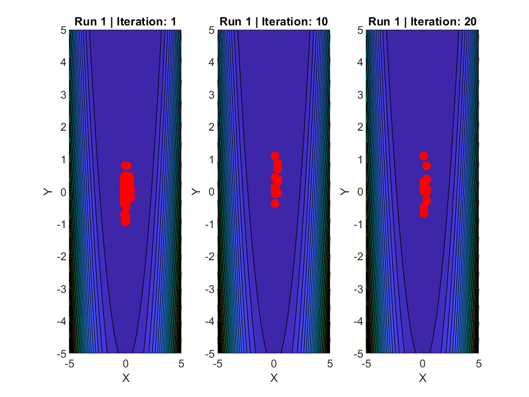

# 📘 Evolutionary Computing & Fuzzy Logic – MATLAB Implementation  
### *By Sahil Dastagir Mujawar*

This repository contains my complete implementation of **Differential Evolution**, **Genetic Algorithms**, and **Fuzzy Logic systems** in MATLAB.  
The project demonstrates optimization techniques, multi-run analysis, visualization, and rule-based fuzzy inference — developed as part of my MSc Artificial Intelligence coursework at De Montfort University.

---

## 📁 Repository Structure

Evolutionary-Computing-and-Fuzzy-Logic-Sahil/
│
├── Differential_Evolution/
│   ├── de.m
│   ├── Sphere.m
│   └── Rosenbrock.m
│
├── Genetic_Algorithm/
│   ├── RunGA.m
│   ├── RunMultipleTimes.m
│   ├── SelectionFunction.m
│   ├── TournamentSelection.m
│   ├── RankSelection.m
│   ├── RouletteWheelSelection.m
│   ├── Crossover.m
│   ├── Mutation.m
│   ├── SortPopulation.m
│   ├── RosenbrockFunction.m
│   ├── FullPipeline.m
│   ├── ComputeFinalStatistics.m
│   └── FinalStatistics.m
│
├── Fuzzy_Logic/
│   └── fuzzy_logic.m
│
└── Results/
    ├── Run1_SideBySide.png
    ├── Run2_SideBySide.png
    ├── Run3_SideBySide.png
    ├── Run4_SideBySide.png
    ├── Run5_SideBySide.png
    ├── Run6_SideBySide.png
    ├── Run7_SideBySide.png
    ├── Run8_SideBySide.png
    ├── Run9_SideBySide.png
    ├── Run10_SideBySide.png
    ├── Run11_SideBySide.png
    ├── Run12_SideBySide.png
    ├── Run13_SideBySide.png
    ├── Run14_SideBySide.png
    ├── Run15_SideBySide.png
    ├── Run16_SideBySide.png
    ├── Run17_SideBySide.png
    ├── Run18_SideBySide.png
    ├── Run19_SideBySide.png
    ├── Run20_SideBySide.png
    ├── results_A.txt
    ├── results_B.txt
    └── results_C.txt

---

## 🚀 Project Overview

### 🔹 1. Differential Evolution (DE)
Includes:
- Mutation operator  
- Recombination  
- Fitness evaluation  
- Sphere & Rosenbrock functions  

### 🔹 2. Real-Coded Genetic Algorithm (GA)
Includes:
- Tournament Selection  
- Rank & Roulette Selection  
- Uniform Crossover  
- Mutation  
- Multi-run analysis (`RunMultipleTimes.m`)  
- Automated plots  

### 🔹 3. Fuzzy Logic System
Includes:
- Membership functions  
- Fuzzification  
- Rule evaluation  
- Defuzzification  
- Visualization  

---

## 📊 Results & Visualization

The **Results** folder contains:
- 20+ side-by-side comparison plots  
- Final fitness statistics  
- Convergence behavior analysis  

### Example visualization:


---

## ▶️ How to Run

1. Open MATLAB  
2. Navigate to this folder  
3. Run GA:
   ```matlab
   RunGA

🛠️ Tools Used

MATLAB R2023b

Differential Evolution

Real-Coded Genetic Algorithm

Custom fuzzy logic system

🎯 Key Learnings

Implementing evolutionary algorithms

Designing selection, crossover, mutation strategies

Multi-run statistical evaluation

Optimization visualization

Fuzzy logic system design

Writing modular MATLAB code

📬 Contact

Sahil Dastagir Mujawar
📍 Leicester, UK
🔗 LinkedIn: https://www.linkedin.com/in/sahil-mujawar-75a484200

🔗 GitHub: https://github.com/SahilMujawar03

Feel free to explore and connect!
